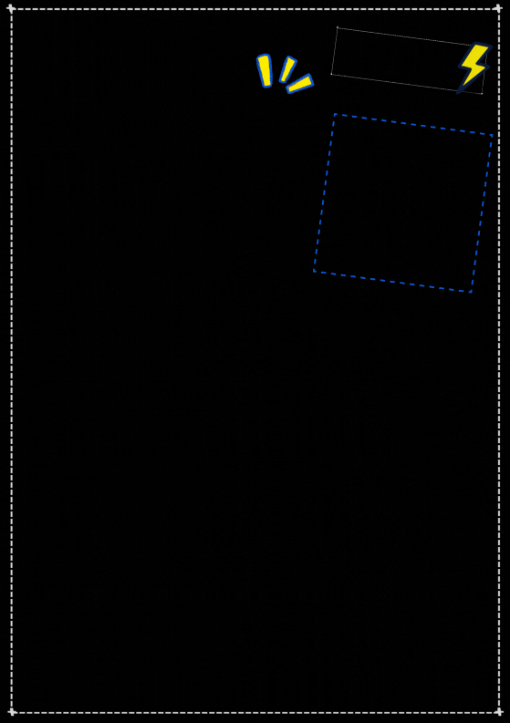
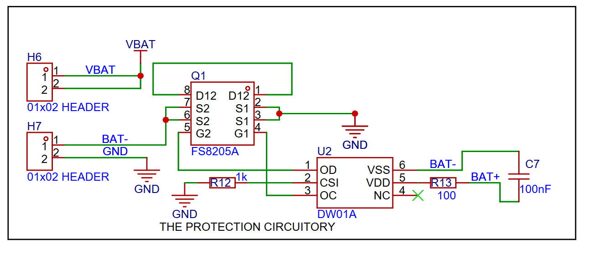
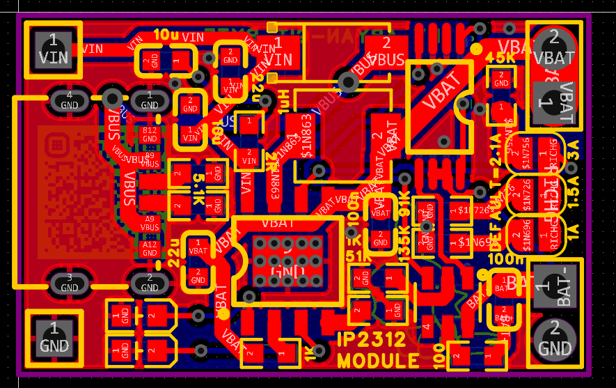
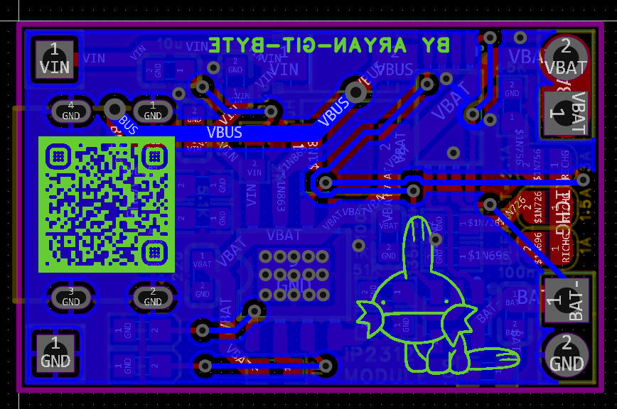
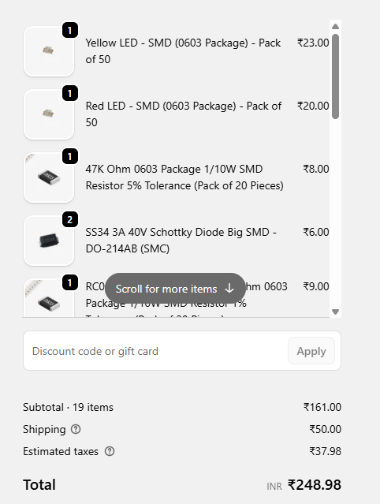
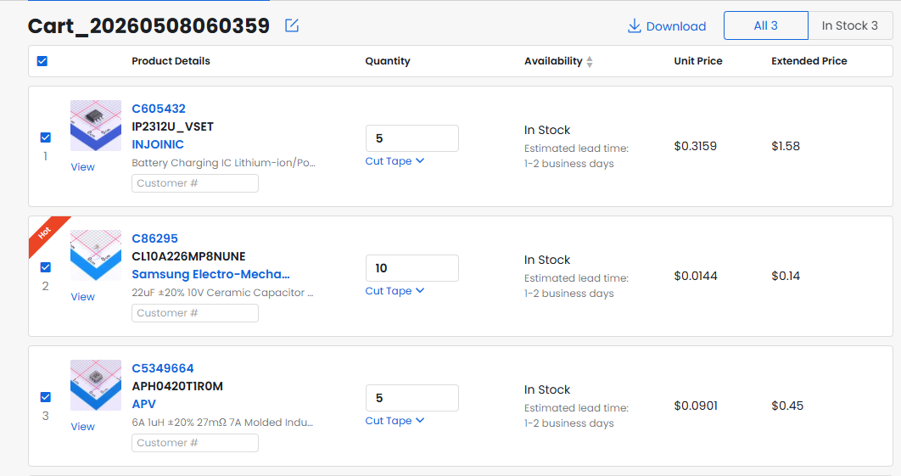
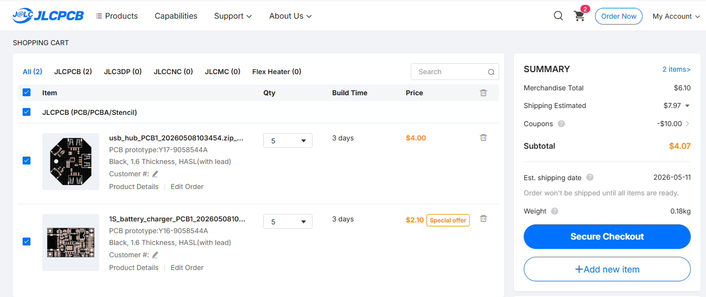

# 1S Bat Charger
Yoo, I wanted to make a 1S battery charger that is more efficient and faster than the typical tp4056 module but in the same form factor
## Overview:

## What even is this??
It is a IP2312 based 1S battery charger that is a 1:1 form factor to the typical tp4056 module use, it is configurable with the 3 solderable pads near the output terminals, soldering whom changes its charging current from default 2.1A to the selected option. And also it has protections such as overcharge, overdischarge etc

## Applications:

Anyone can use this simple module in their projects for charging a simple 1S battery.

# Schematic Overview:

this is the Voltage in part of the module, u can power it from either the type-c port or the terminal by powering it with 5V.

this is the CC config part of the schematic which shows 3 jumpers from which u can configure the CC of the module, between 1A, 1.5A and 3A with default being 2.1 A

this is the connection of ip2312 along with its peripherals and etc

this is the part that shows the protection circuit and the output headers

# PCB overview:

these photos show the routing of the pcb with a qr leading to the repo.

here are some photos of the 2D and 3D render of the PCBs:

# BOM:
Quartz component (quartzcomponents.com)
cart:

Item name | quantity | unit price | link| total 
---------|-----------|-------|-----|-
Type-C 6 pin connector| 2 | 5 rs | [link](https://quartzcomponents.com/products/c-type-female-usb-port-plug-6-pin-smd-smt-jack-solder-connector?variant=45108613841130)| 10 rs
100 nF Capacitor 0603 (pack of 20)|1|11 rs | [link](https://quartzcomponents.com/products/kemet-100nf-50v-0603-smd-pack-x7r-multilayer-ceramic-capacitor-10-tolerence-pack-of-20?variant=45972486193386&country=IN&currency=INR&utm_medium=product_sync&utm_source=google&utm_content=sag_organic&utm_campaign=sag_organic&srsltid=AfmBOopnfKv3gKdibyX3qxzEoiDa6hgtUaGOK5H7Lh-MDVl_BFFMZAF-OTY)| 11 rs
 10 uf Capacitor 0603 (pack of 20)|1|21 rs | [link](http://quartzcomponents.com/products/kemet-10uf-50v-0603-smd-pack-x5r-multilayer-ceramic-capacitor-20-tolerence-pack-of-20?variant=45972488650986&country=IN&currency=INR&utm_medium=product_sync&utm_source=google&utm_content=sag_organic&utm_campaign=sag_organic&srsltid=AfmBOormQjJdVIfUPm8Jzy_H09CPX3UB9iPiFBMJn146FeXnQVx0CRSwGLQ)| 21 rs
 5.1k resistor 0603 (pack of 20)|1|6 rs | [link](https://quartzcomponents.com/products/yageo-5-1k-ohm-0603-package-1-10w-smd-resistor-1-tolerance-pack-of-20-pieces?variant=45985100988650&country=IN&currency=INR&utm_medium=product_sync&utm_source=google&utm_content=sag_organic&utm_campaign=sag_organic&srsltid=AfmBOorH8L1eFtB1-geEdVXaVFxpQT2Zs7EzmjMSqO0NkfrEaKZ44usU9sg)| 6 rs
  1k resistor 0603 (pack of 20)|1|8 rs | [link](https://quartzcomponents.com/products/1k-ohm-0603-package-1-10w-smd-resistor-5-tolerance-pack-of-20-pieces?variant=44678124044522&country=IN&currency=INR&utm_medium=product_sync&utm_source=google&utm_content=sag_organic&utm_campaign=sag_organic&srsltid=AfmBOooTZUS1zsB4f3PE5dWbeMA6i-khZqG8HhMp-ZGxgsbvsS7hYUcOOro)| 8 rs
 51k resistor 0603 (pack of 20)|1| 6 rs | [link](https://quartzcomponents.com/products/yageo-51k-ohm-0603-package-1-10w-smd-resistor-1-tolerance-pack-of-20-pieces?variant=45985102332138&country=IN&currency=INR&utm_medium=product_sync&utm_source=google&utm_content=sag_organic&utm_campaign=sag_organic&srsltid=AfmBOoqbjjwV_UHg0Lax1IWi7jHHWlf-xfHOJVs84NUd0JU7kGvNx_F1Xpw)|6 rs
  91k resistor 0603 (pack of 20)|1| 6 rs | [link](https://quartzcomponents.com/products/yageo-91k-ohm-0603-package-1-10w-smd-resistor-1-tolerance-pack-of-20-pieces?variant=45985108295914&country=IN&currency=INR&utm_medium=product_sync&utm_source=google&utm_content=sag_organic&utm_campaign=sag_organic&srsltid=AfmBOor0ea95SrJi8yn5Zt0QZCCG9dhOpSgbyvPrJ9jHpvhUALEqZPh51aI)|6 rs
  120k resistor 0603 (pack of 20)|1| 9 rs | [link](http://quartzcomponents.com/products/yageo-120k-ohm-0603-package-1-10w-smd-resistor-1-tolerance-pack-of-20-pieces?variant=45952341246186&country=IN&currency=INR&utm_medium=product_sync&utm_source=google&utm_content=sag_organic&utm_campaign=sag_organic&srsltid=AfmBOoqD1xMo2XI7g5XhKPoqJ9W9hDNNtiCRHRYkYfh4kdY6JQGZcEVUeKg)|9 rs 
  47k resistor 0603 (pack of 20)|1|8 rs | [link](https://quartzcomponents.com/products/47k-ohm-0603-package-1-10w-smd-resistor-5-tolerance-pack-of-20-pieces?variant=44678130925802&country=IN&currency=INR&utm_medium=product_sync&utm_source=google&utm_content=sag_organic&utm_campaign=sag_organic&srsltid=AfmBOooEL6uf77b9l2pxGdnVwymb6JvfqBUMuJU-KKfQ8cQ5B9Sd4wPhqfc)| 8 rs
  100 resistor 0603 (pack of 20)|1| 9 rs | [link](https://quartzcomponents.com/products/yageo-100-ohm-0603-package-1-10w-smd-resistor-1-tolerance-pack-of-20-pieces?variant=45952333578474&country=IN&currency=INR&utm_medium=product_sync&utm_source=google&utm_content=sag_organic&utm_campaign=sag_organic&srsltid=AfmBOoppXmC4GyHg-D7tW9oWGStRGSVOujVzoYP1A64Qxte1bjKUFmxHnck)|9 rs 
 schotkky diode | 2 | 3 rs | [link](https://quartzcomponents.com/products/ss34-3a-40v-schottky-diode-big-smd-do-214ab-smc?variant=45090730213610&country=IN&currency=INR&utm_medium=product_sync&utm_source=google&utm_content=sag_organic&utm_campaign=sag_organic&srsltid=AfmBOoqYL4UuhSCNlZop6JilovdNrUi0lwQPyl2L_DmsVe7MjnFCDSTo-Bo)|6 rs
 FS8205A | 2 | 5 rs | [link](https://quartzcomponents.com/products/fs8205a-dual-n-channel-power-mosfet-tssop-8-package?variant=45108749467882&country=IN&currency=INR&utm_medium=product_sync&utm_source=google&utm_content=sag_organic&utm_campaign=sag_organic&srsltid=AfmBOortu6IVpoaGA1MsOxUJhfb98oX593FlukBAKQ-ZaavC_BDgcH1XD_8)|10 rs
 DW01A | 2 | 4 rs | [link](https://quartzcomponents.com/products/dw01a-lithium-ion-lithium-polymer-battery-protection-ic-sot-23-6-smd-package?variant=45090775204074&country=IN&currency=INR&utm_medium=product_sync&utm_source=google&utm_content=sag_organic&utm_campaign=sag_organic&srsltid=AfmBOoptIwAgf4qBV60TjbVLHhYQXmEZqvKJ9SMoHtxKj-r2VrewvjFFU7Y)| 8 rs
 Yellow led 0603 (pack of 50)| 1 | 23 rs | [link](https://quartzcomponents.com/products/yellow-led-smd-0603-package-pack-of-50?variant=44704065814762&country=IN&currency=INR&utm_medium=product_sync&utm_source=google&utm_content=sag_organic&utm_campaign=sag_organic&srsltid=AfmBOooTNEnHwsaDDyMyuWPxggbWWBhAN8Igc-gD-a18oIFbk8PiU-8gBCk)|23 rs
 Green led 0603 (pack of 50) | 1 | 20 rs | [link](https://quartzcomponents.com/products/red-led-smd-0603-package-pack-of-50?variant=44704065356010&country=IN&currency=INR&utm_medium=product_sync&utm_source=google&utm_content=sag_organic&utm_campaign=sag_organic&srsltid=AfmBOoqyHxGmrj95CkjT8VpNloH8t5yuakPLkc6Fr4Ay6OQRMtNGerM9YdM)|20 rs
 taxes| | 37.98 rs| | 37.98 rs
 Shipping| | 50 rs| | 50 rs

- Subtotal - 161 rs (1.70 usd)
- total - 248.98 rs (2.64 usd)

LCSC:

|item name | quantity | price | link
|-|-|-|-
IP2312U|5|1.58 usd |https://www.lcsc.com/product-detail/C605432.html?spm=wm.gwc.xh.0.tp___wm.sy.ssl.gwc&lcsc_vid=RVNcVlIFRAUIAQJfRVdeUlwDFVldBVUFE1QNVVFXRVAxVlNRT1NdUVJQTlJdVTtW
22 uf 0603 cap|10|0.14 usd |https://www.lcsc.com/product-detail/C86295.html?spm=wm.gwc.xh.1.tp___wm.sy.ssl.gwc&lcsc_vid=RVNcVlIFRAUIAQJfRVdeUlwDFVldBVUFE1QNVVFXRVAxVlNRT1NdUVJQTlJdVTtW
1 uh inductor smd | 5 |0.45 usd | http://lcsc.com/product-detail/C5349664.html?spm=wm.gwc.xh.2.tp___wm.sy.ssl.gwc&lcsc_vid=RVNcVlIFRAUIAQJfRVdeUlwDFVldBVUFE1QNVVFXRVAxVlNRT1NdUVJQTlJdVTtW

The shipping of this lcsc parts will be paired along with that of the JLCPCB, saving on the Shipment cost.
and JLCPCB:

and i will also be ordering the pcb of the battery charger along with the usb hub saving me more on shipping.

Now, total:
|site | total(inr)|total(usd)
|-|-|-
quartz component | 249 rs | 2.64 usd
lcsc.com| 205 rs | 2.17 usd
JlCPCB.com|199 rs | 2.10 usd 
Total| 653 rs | 6.91 usd